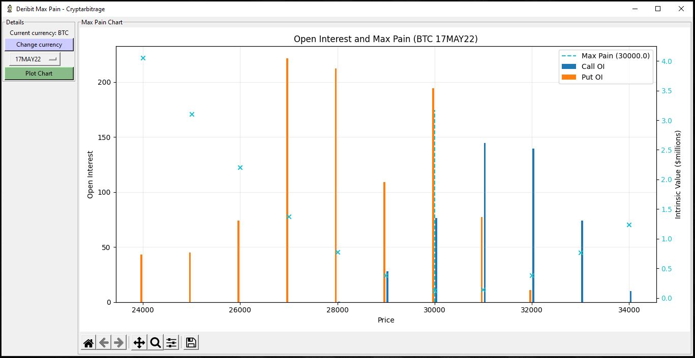
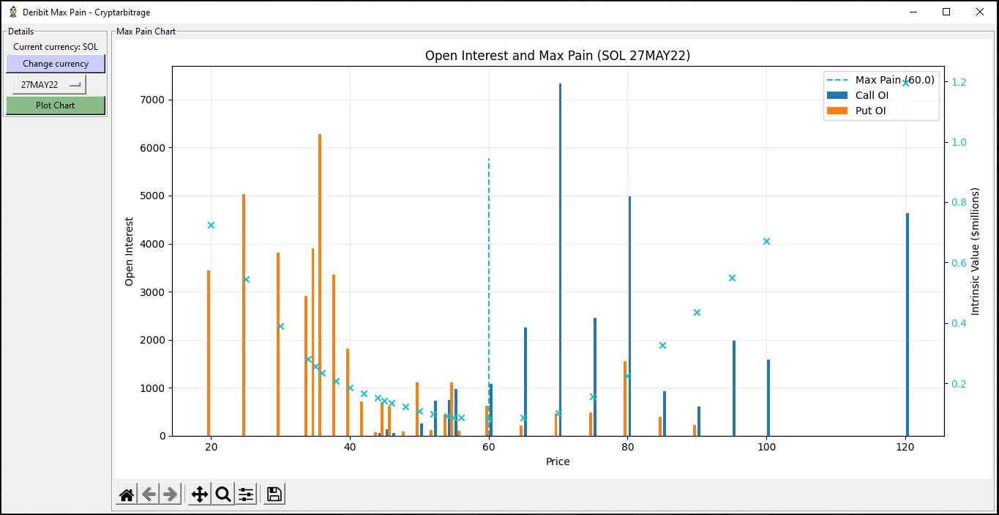

# Deribit Max Pain
Python code that pulls in option open interest data from Deribit, then displays the 'max pain' calculation for the chosen expiration.
Max pain is a relatively simple calculation that simply shows which underlying price would currently result in the lowest total value of all currently held options, if they were all to expire immediately.

The chart shows the open interest values for calls and puts, as well as the total intrinsic value calculation.
The strike price at which the intrinsic value would be lowest, is labelled the max pain.

Go to https://github.com/cryptarbitrage-code/deribit-max-pain for the latest code.

Follow me on https://twitter.com/cryptarbitrage for other free resources and content.

Deribit ref-link: https://www.deribit.com/?reg=1332.557&q=home (10% discount on trading fees)

## GUI and Charts
Tkinter is used for the GUI, and Matplotlib is used to plot the charts.

## Deribit API endpoints
This program uses the following api endpoints:

get_book_summary_by_currency 